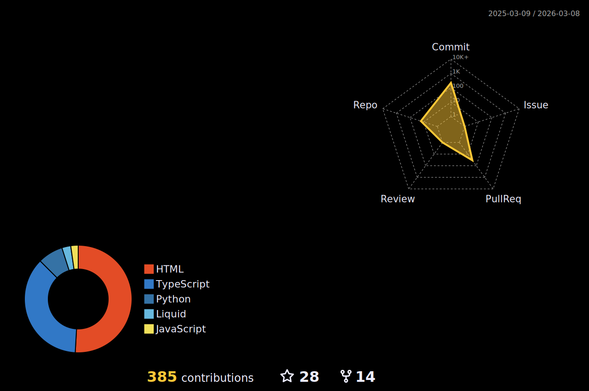

  
  

<h3 align="center">
  Hi there, I'm Mohammad Shakib
  
</h3> 

  

- 🎓 Pursuing B. Sc in Computer Science and Engineering [(CSE)](https://www.bracu.ac.bd/academics/departments/computer-science-and-engineering/bachelor-science-computer-science-and/cse) at [BRAC University](https://www.bracu.ac.bd/)
- 👷‍♂️ I’m working on Web Development
- 🧠 Currently learning Database and Operating systems 
- 🔭 Looking for help with Database
- 📫 Mail me: [shakib@duck.com](mailto:shakib@duck.com)
- ⚡ Fun fact: The first program I wrote wasn't "Hello, World!" 😌 
- 📃 Checkout my [resume](https://github.com/Mo-Shakib/Mo-Shakib/blob/main/Resume_300821.pdf)
- 🌐 Web: [Mohammad Shakib](https://mo-shakib.github.io)
<!-- - 💬 Ask me about Python -->
### 🔗 Connect with me:
<!-- style=flat-square& -->
<!--  -->

### ⚡ Skills:

<!--  -->
<!--  -->
<!--  -->
<!-- style=flat-square& -->

### 🛠 Tools:

<!--    -->
  
  
  
  
  
<!--    -->
  
  

## 💻 GitHub Stats

  
   
<!--   <b>Note:</b> <i>Top languages is only a metric of the languages my public code consists of and doesn't reflect experience or skill level.</i> -->

	
  
<b>🔥 Github Streaks</b>
 
  

  

	
  
<b>&#x1f4c8; Github activity graph</b>

  <!-- Github activity graph -->

<!-- &hide=other -->

	
  
<b>&#x23F2; Coding Activity over last 7 days</b>
 
  

    
  

 
  
